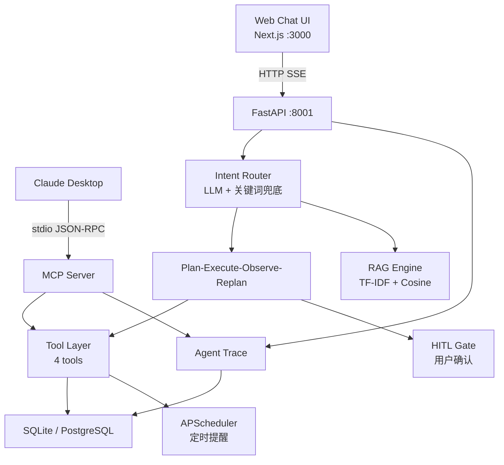

# FitAgent — 任务型健身 Agent 平台

一个用于展示 Agent 系统工程能力的项目。支持 Web Chat 和 MCP 协议双通道访问，
同一套 Agent Runtime 同时服务于人类用户和外部 AI Agent。

---

## 架构



## 核心设计

| 模块 | 说明 |
|------|------|
| **Intent Router** | 6 种意图分类。LLM 主路由 + 关键词兜底（confidence < 0.7），最终 fallback 到 casual_chat |
| **PER 工作流** | Plan → Execute → Observe → Replan 四阶段。Replan 支持 4 种动作：request_input / retry_once / simple_fix / graceful_fail |
| **HITL** | SSE 事件驱动的确认门。高影响操作暂停执行等待用户确认。内存存储，300s 超时 |
| **RAG** | 39 条精选健身知识，10 个分类。TF-IDF 向量化 + Cosine 相似度检索。四层降级策略 |
| **Agent Trace** | 每次对话记录 intent / confidence / tools_called / latency_ms，写入 agent_trace 表 |
| **MCP Server** | 4 tools + 4 resources + 5 prompts。手写 JSON-RPC 2.0 stdio 协议实现，兼容 Claude Desktop |
| **Reminder Runtime** | APScheduler cron job。启动时从 DB 恢复 active jobs。ReminderEvent 审计记录 |
| **双通道** | Web Chat (HTTP SSE) 和 Claude Desktop (MCP stdio) 共享 Tool / RAG / DB |

## 快速启动

### 一键启动（推荐）

```bash
# Windows — 自动创建 conda 环境 + 安装依赖 + 启动前后端
scripts\dev-start.bat

# 停止
scripts\dev-stop.bat

# 重启
scripts\dev-restart.bat
```

首次运行会自动：
1. 检查/创建 `fitagent` Conda 环境
2. 安装 Python 依赖
3. 执行数据库迁移
4. 安全停止旧进程
5. 在独立窗口中启动后端和前端

### 环境检查

```bash
python scripts/check-env.py
```

### 手动启动

```bash
# 0. 创建 Conda 环境（仅首次）
conda env create -f environment.yml
conda activate fitagent

# 备用方案（无 Conda 时）：
#   python -m venv .venv
#   Windows: .venv\Scripts\activate
#   macOS/Linux: source .venv/bin/activate
#   pip install -r backend/requirements.txt

# 1. 安装后端依赖 + 初始化数据库
cd backend
pip install -r requirements.txt
alembic upgrade head
uvicorn app.main:app --reload --port 8001

# 2. 启动前端
cd ../frontend
npm install
npm run dev

# 3. 浏览器打开 http://localhost:3000
```

### MCP 协议测试

```bash
# Windows
scripts\test-mcp.bat

# macOS / Linux
./scripts/test-mcp.sh
```

开发阶段使用 SQLite，不需要 Docker。完整设置指南见 [docs/manual-setup.md](docs/manual-setup.md)。

## Claude Desktop 集成

```json
{
  "mcpServers": {
    "fitagent": {
      "command": "python",
      "args": ["-m", "app.mcp.server"],
      "cwd": "/path/to/FitAgent/backend",
      "env": { "PYTHONPATH": "/path/to/FitAgent/backend" }
    }
  }
}
```

配置路径：Claude Desktop → Settings → Developer → MCP。
Demo 场景见 [docs/claude-desktop-demo.md](docs/claude-desktop-demo.md)。

## MCP 能力

**Tools (4)**：`generate_training_plan` | `log_workout_record` | `search_fitness_knowledge` | `create_weekly_reminder`

**Resources (4)**：`fitness://active-plan` | `fitness://monthly-summary` | `fitness://history/latest` | `fitness://reminders/status`

**Prompts (5)**：`create-fitness-plan` | `weekly-review` | `monthly-summary-analysis` | `workout-consistency-check` | `beginner-guidance`

## 目录结构

```
FitAgent/
├── backend/app/
│   ├── api/v1/          # REST API
│   ├── core/agent/      # LangGraph + Intent Router + PER + HITL
│   │   └── nodes/       # 5 intent nodes + per_subgraph
│   ├── core/tools/      # 3 core tools
│   ├── core/rag/        # seed_data + TF-IDF + retriever
│   ├── core/reminder/   # APScheduler + callback
│   ├── core/trace/      # Agent Trace logger
│   ├── mcp/             # MCP Server (JSON-RPC 2.0 stdio)
│   │   ├── adapters/    # 4 thin adapters
│   │   └── prompts/     # 5 prompt templates
│   ├── models/          # SQLAlchemy ORM (7 tables)
│   └── services/        # Business logic
├── frontend/src/
│   ├── app/             # Pages (chat, calendar)
│   ├── components/      # Chat, Calendar, Dashboard, ConfirmationModal
│   └── lib/             # API client, types
├── docs/
│   ├── architecture/    # 5 Mermaid diagrams
│   ├── interview/       # 面试讲稿 + FAQ
│   ├── manual-setup.md
│   └── deployment.md
└── CLAUDE.md
```

## 测试

```
117 tests (pytest)
├── 28 MCP tools (4 tools × validation + error)
├── 20 MCP resources (4 resources × valid/missing/edge)
├── 15 MCP prompts (5 prompts + protocol)
├── 26 PER (Plan/Execute/Observe/Replan + HITL)
├──  7 Core tools
├── 16 RAG (seed / TF-IDF / retriever / KB)
└──  5 Reminder scheduler
```

## 开发阶段

| 阶段 | 状态 | 内容 |
|------|------|------|
| Phase 1 | ✅ | MVP 闭环：chat → plan → workout → calendar |
| Phase 2A | ✅ | LLM Client + RAG 知识库 |
| Phase 2B | ✅ | Plan-Execute-Observe-Replan 子图 |
| Phase 2C | ✅ | APScheduler 提醒 + HITL 确认 |
| Phase 3A | ✅ | Demo 就绪检查（7 场景验证） |
| Phase 3B | ✅ | MCP Server (tools + resources + prompts) |
| Phase 4A | ✅ | 企业包装 + 面试准备 |
| Phase 4B | ✅ | 中文化 + 最终润色 |

## 这个项目展示了什么

1. **自建 Agent 工作流** — 不是 LangChain AgentExecutor 套壳。Intent Router、PER 子图、HITL Gate、Agent Trace 都是独立设计的
2. **协议层理解** — MCP Server 是手写 JSON-RPC 2.0 over stdio，不是 SDK wrapper
3. **安全设计** — HITL 阻止静默高风险操作，PER 有 bounded retry，RAG 有四层降级
4. **可观测性** — Agent Trace 从第一天就记录每次对话的决策、工具调用和延迟
5. **多客户端架构** — 一套 Runtime 同时服务 Web Chat 和 MCP Client

## 文档

| 文档 | 说明 |
|------|------|
| [Manual Setup](docs/manual-setup.md) | 分步设置指南（Why/Verify/Troubleshoot） |
| [Architecture](docs/architecture/) | 5 张 Mermaid 架构图 |
| [Interview Prep](docs/interview/) | 5 分钟讲稿 + 12 个常见问题 |
| [Claude Desktop Demo](docs/claude-desktop-demo.md) | 5 个 MCP Demo 场景 |
| [Deployment](docs/deployment.md) | 本地 / Docker / 生产部署 |

## 技术栈

| 层 | 技术 |
|----|------|
| 前端 | Next.js + TypeScript + Tailwind CSS + FullCalendar |
| 后端 | Python FastAPI |
| Agent 框架 | LangGraph (StateGraph) |
| 数据库 | SQLite (dev) / PostgreSQL + pgvector (prod) |
| 缓存 | Redis |
| 调度 | APScheduler |
| RAG | TF-IDF + Cosine Similarity |
| MCP | JSON-RPC 2.0 stdio (手写实现) |

## License

MIT
