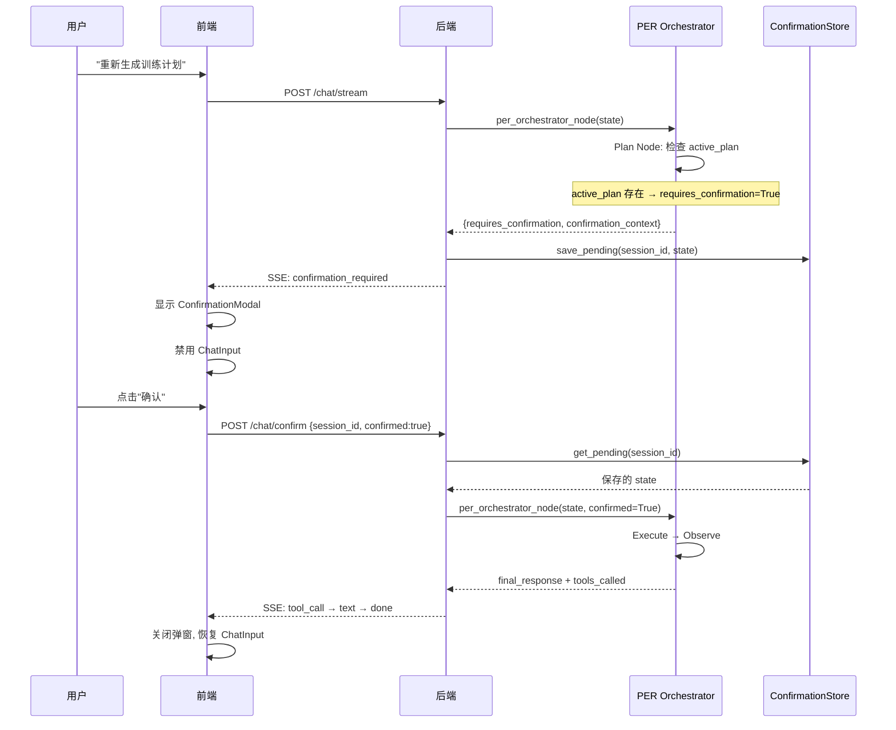

# Human-in-the-Loop 确认机制

## 时序图



## 设计决策

### 为什么确认在 Execute 之前

Plan 之后已经知道要做什么，但还没执行。用户取消时不需要回滚——DB 没有任何写入。如果确认在 Execute 之后，取消需要回滚已写入的数据。

### 为什么用内存存储

确认状态是暂时的（300s 超时），不需要持久化。如果服务重启，用户重新发起请求即可。加 DB 表是过度设计。

### 为什么用 SSE 推送

前端不轮询，由服务端通过 `type: "confirmation_required"` SSE 事件主动推送。更低的延迟和服务器负载。

## ConfirmationStore API

```python
save_pending(session_id, user_id, state, target, context)
get_pending(session_id) → dict | None  # 自动清理过期
delete_pending(session_id) → bool
```

## 确认目标

| Target | 触发条件 | 影响 |
|--------|---------|------|
| plan_regeneration | create_plan + 已有 active_plan | 覆盖当前计划 |
| workout_deletion | (待实现) | 不可逆删除 |
| reminder_change | (待实现) | 影响持续性调度 |

## Agent Trace

每次确认事件记录:
- confirmation_target: 确认什么
- confirmation_result: required / confirmed / cancelled / timeout
- confirmation_waited_ms: 用户响应时间
