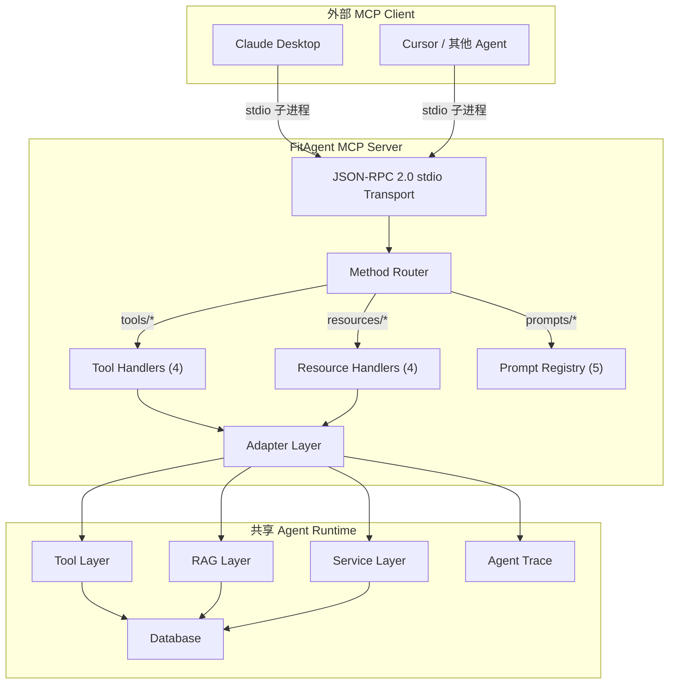

# MCP (Model Context Protocol) 架构

## 架构图



## 能力矩阵

| 层 | 数量 | 内容 |
|----|------|------|
| Tools | 4 | generate_training_plan, log_workout_record, search_fitness_knowledge, create_weekly_reminder |
| Resources | 4 | active-plan, monthly-summary, history/latest, reminders/status |
| Prompts | 5 | create-fitness-plan, weekly-review, monthly-summary-analysis, workout-consistency-check, beginner-guidance |

## 协议实现

手写 JSON-RPC 2.0 over stdio（约 300 行）。不用官方 SDK 的原因：SDK 的 pydantic 版本要求与项目冲突。

手写实现的优势：零额外依赖、协议层完全可控、体现对 MCP spec 的理解深度。

### 消息流

```
Claude Desktop 启动子进程: python -m app.mcp.server
  │
  ├─→ initialize → capabilities: {tools, resources, prompts}
  ├─→ tools/list → [4 tool definitions with inputSchema]
  ├─→ tools/call → adapter → Tool Layer → content blocks
  ├─→ resources/read → adapter → Service Layer → content
  └─→ prompts/get → Prompt Registry → messages
```

## Adapter 模式

```
MCP Request → Adapter → 现有 Tool Function → MCP Response
              (验证)    (执行业务逻辑)        (格式化)
```

适配器只做验证参数、调用工具、格式化输出。业务逻辑在 Tool Layer，适配器不复制。

## URI 设计

```
fitness://active-plan?user_id={uuid}
fitness://monthly-summary?user_id={uuid}&year=2026&month=5
fitness://history/latest?user_id={uuid}&limit=10
fitness://reminders/status?user_id={uuid}
```

## 双通道一致性

```
        ┌──────────────────┐
        │  Agent Runtime   │
        │  (Tool/RAG/DB)   │
        └────┬────────┬────┘
             │        │
  HTTP SSE   │        │  stdio JSON-RPC
             │        │
        ┌────▼──┐ ┌──▼──────────┐
        │Web Chat│ │Claude Desktop│
        └────────┘ └──────────────┘
```

Web Chat 创建的计划，Claude Desktop 通过 `fitness://active-plan` 立即可见。同一数据库，不存在同步问题。
