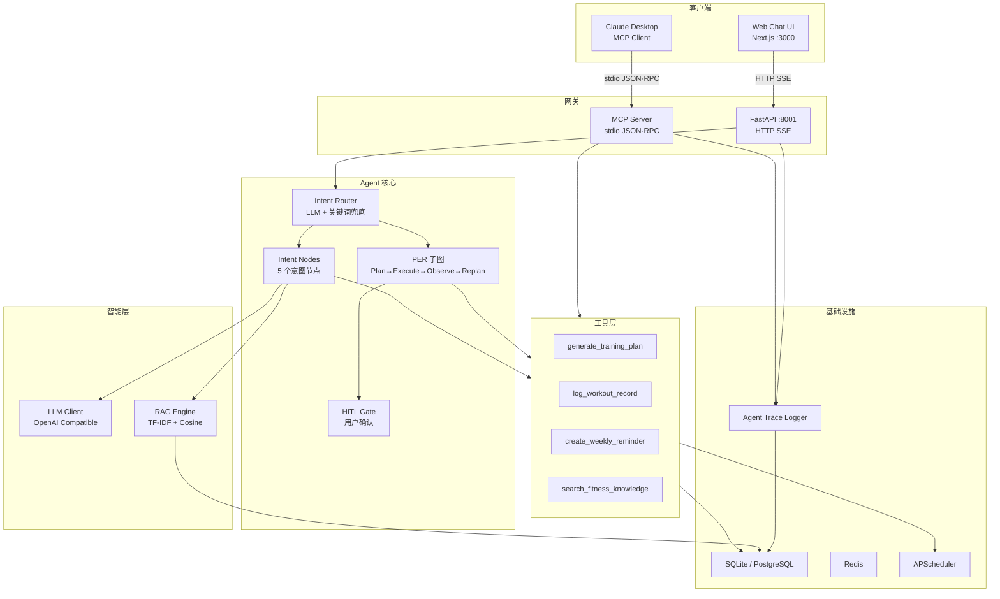

# FitAgent 系统架构

## 架构图



## 关键设计决策

### 双客户端架构

FitAgent 通过同一套 Agent Runtime 服务两种客户端：

| 客户端 | 传输方式 | 使用场景 |
|--------|---------|---------|
| Web Chat UI | HTTP SSE (:8001) | 用户在浏览器中对话 |
| Claude Desktop | stdio JSON-RPC (MCP) | 外部 AI Agent 调用工具和数据 |

两者共享 Tool Layer、RAG 引擎、数据库和 Agent Trace。Web Chat 创建的训练计划，Claude Desktop 通过 MCP Resource 立即可见。

### 为什么用 LangGraph StateGraph

LangGraph 提供显式状态管理和条件路由。与 LangChain AgentExecutor 的黑盒模式不同，StateGraph 提供：
- 可见的状态转换，便于调试
- 节点级可观测性（Agent Trace 记录每个节点）
- 干净的条件路由（PER 子图需要循环边）
- HITL 中断点支持

### 为什么手写 MCP 协议

`mcp` Python SDK 的 pydantic 版本要求与项目冲突。手写 JSON-RPC 2.0 over stdio（约 300 行）：
- 零额外依赖
- 完全符合 MCP spec
- 体现协议层理解深度

### Adapter 模式

所有 MCP tool 通过薄适配器（`app/mcp/adapters/`）调用现有 Tool Layer。适配器只做：
1. 验证 MCP 参数
2. 调用现有工具函数
3. 格式化为 MCP content block

业务逻辑零重复。

## Web Chat 请求数据流

```
用户输入 → FastAPI → Guardrails → Intent Router
  → [casual_chat] → LLMClient.chat() → SSE 响应
  → [fitness_qa]  → RAG Retriever → LLMClient.chat() → SSE 响应
  → [create_plan] → PER 子图
      → Plan: 校验 profile → 生成 plan_steps
      → [HITL Gate: 如果有 active_plan 则需确认]
      → Execute: generate_training_plan → create_weekly_reminder
      → Observe: 5 项验证
      → [Replan: 失败时重试/修正/请求输入/优雅失败]
  → [log_workout] → LLMClient.chat_structured() → DB 保存
  → [query_history] → DB 查询 → 格式化响应
  → Agent Trace 写入
```

## MCP 请求数据流

```
Claude Desktop → stdio JSON-RPC → MCP Server
  → tools/call → Adapter → Tool Layer → DB → MCP Content Block
  → resources/read → Service Layer → DB → MCP Content
  → prompts/get → Prompt Registry → Messages → Claude
```
