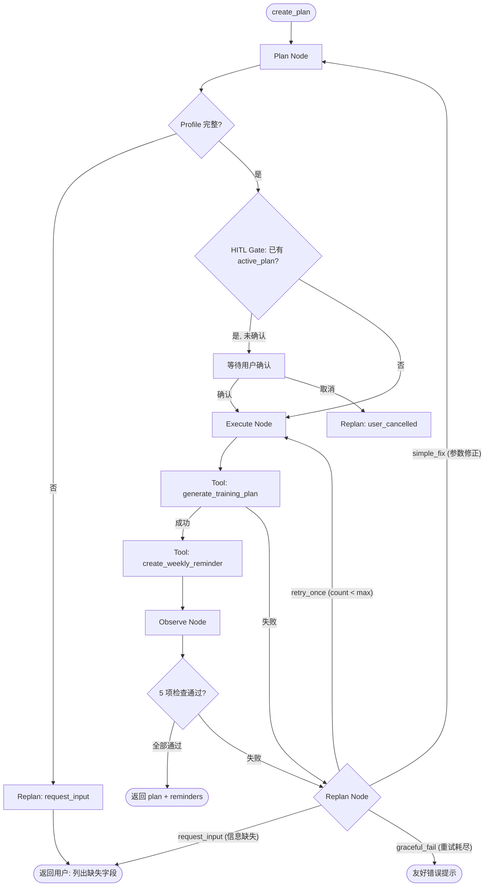

# Plan-Execute-Observe-Replan 工作流

PER 子图是 create_plan / update_plan 意图的核心工作流，实现四阶段循环。

## 状态机

## 节点职责

### Plan Node
- **输入**: user_input, user_profile, active_plan
- **输出**: plan_steps, requires_confirmation, observation_passed
- **检查**: user_profile 存在 → 6 字段齐全 → HITL Gate
- **设计**: 确定性逻辑，不依赖 LLM

### Execute Node
- **输入**: plan_steps, user_profile, user_id
- **输出**: tool_results, tools_called
- **行为**: 按 plan_steps 顺序调用工具。首步失败即停。reminder 失败不回滚 plan

### Observe Node
- **输入**: tool_results, user_profile
- **输出**: observation_passed, observation_errors, final_response
- **5 项验证**: plan 已执行 → DB 有记录 → plan_data 非空 → reminder 成功 → job 数量匹配
- **分类**: plan 失败 = 关键 (阻止), reminder 失败 = 非关键 (警告)

### Replan Node
- **4 种动作**:
  - `request_input` — profile 不完整，要求用户补充
  - `retry_once` — 工具失败，重试 1 次
  - `simple_fix` — 参数越界，自动修正（如 weekly_days 10 → 7）
  - `graceful_fail` — 重试耗尽，友好错误提示
- **安全边界**: MAX_REPLANS=1。不自动提高训练强度。不修改用户长期偏好。
