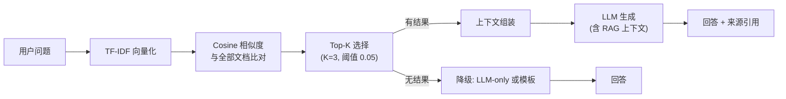

# RAG 检索增强生成架构

## 管道

## 知识库

- **39 条精选文档**, 10 个分类
- 分类: beginner_principles, fat_loss_basics, muscle_gain_basics, full_body_training, ppl_training, home_exercises, gym_exercises, training_frequency, rest_recovery, common_mistakes
- 内容约束: 无医疗诊断、无药物建议、无危险训练指导

## 检索引擎

### 为什么用 TF-IDF 而不是 pgvector

- 零外部依赖，SQLite 环境可运行
- 39 条文档规模下精度足够
- 接口签名不变，后续可切换 pgvector

### 算法

1. 分词: 中文单字 + 双字 bigram + 英文单词 + 数字
2. TF-IDF: 词频 × 逆文档频率
3. 相似度: Cosine similarity
4. 选择: Top-K 且高于最低阈值

## 四层降级策略

| 层级 | 条件 | 行为 |
|------|------|------|
| Tier 1: RAG + LLM | 检索有结果 + LLM 可用 | 基于知识库回答，附带来源引用 |
| Tier 2: LLM Only | 检索无结果 + LLM 可用 | LLM 基于自身知识回答 |
| Tier 3: RAG 模板 | 检索有结果 + LLM 不可用 | 直接展示检索内容 |
| Tier 4: 完全降级 | 检索和 LLM 都不可用 | 建议使用其他功能 |

## RAG 只用于 fitness_qa

- casual_chat — 不检索
- create_plan — 用模板生成，不检索
- log_workout — 用 LLM 解析，不检索
- query_history — 纯 DB 查询，不检索

避免在不需要知识检索的意图上增加延迟。
