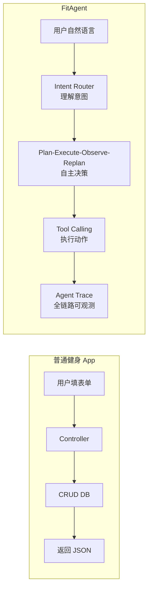

# FitAgent 深度学习指南

> 这份文档的目标：让你不需要 AI 也能独立理解、运行、调试、修改、讲解这个项目。

---

## 一、项目总体认知

### 1.1 FitAgent 到底是什么

FitAgent 是一个**任务型 Agent 平台**，以健身场景为载体。

它不是一个健身 App。健身只是 Demo 场景——你可以把健身换成订餐、排课、客服，核心架构完全复用。

### 1.2 为什么不是普通 CRUD 健身 App



区别：
- 普通 App 用户**操作 UI**，FitAgent 用户**自然语言对话**
- 普通 App 走**固定流程**，FitAgent 走 **Agent 自主决策**
- 普通 App 无意图理解，FitAgent 有 **Intent Router**
- 普通 App 无可观测性，FitAgent 有 **Agent Trace**

### 1.3 为什么是 Agent Platform

```
                    ┌──────────────────┐
                    │  Agent Runtime   │
                    │  (Tool/RAG/DB)   │
                    └────┬────────┬────┘
                         │        │
              HTTP SSE   │        │  stdio JSON-RPC
                         │        │
                    ┌────▼──┐ ┌──▼──────────┐
                    │Web Chat│ │Claude Desktop│
                    │(人类)  │ │(AI Agent)   │
                    └────────┘ └──────────────┘
```

同一套 Runtime 同时服务**人类用户**和**外部 AI Agent**。这是"Platform"的定义——不是单一应用，而是可被多种客户端访问的能力层。

### 1.4 核心亮点

| 亮点 | 为什么重要 |
|------|-----------|
| Intent Router + 关键词兜底 | 即使 LLM 不可用，系统仍能运行 |
| PER 四阶段工作流 | Agent 不只是"调个工具"，而是规划→执行→观察→修正 |
| HITL 确认门 | 高风险操作不静默执行，用户必须确认 |
| RAG 四层降级 | 检索失败/LLM 失败/全部失败都有对应路径 |
| Agent Trace | 每次对话完整记录，Agent 不是黑盒 |
| MCP 手写协议 | 不用 SDK，自己实现 JSON-RPC 2.0 stdio |
| 双通道一致性 | Web 和 Claude Desktop 共享同一 DB |

### 1.5 数据流全景

```
用户输入
  → Next.js (SSE fetch)
  → FastAPI /chat/stream
  → Guardrails (validate_input)
  → Intent Router (classify_intent)
  → [6 种意图之一]
      → casual_chat:   LLMClient.chat() → 回复
      → fitness_qa:    RAG Retriever → LLMClient.chat() → 回复+来源
      → create_plan:   PER Orchestrator → tools → DB → 回复
      → log_workout:   LLM 解析 → DB 写入 → 回复
      → query_history: DB 查询 → 格式化 → 回复
  → Agent Trace (agent_trace 表)
  → SSE 流式推回前端
```

---

## 二、核心功能全景图

### 2.1 用户系统

**为什么存在**：Agent 需要知道你是谁（身高、体重、目标），才能生成个性化计划。

**核心文件**：
- `backend/app/models/user.py` — UserProfile ORM
- `backend/app/services/user_service.py` — register/login/update
- `backend/app/api/v1/user.py` — REST API

**数据流**：
```
POST /register → user_service.register_user() → INSERT user_profile
POST /login → verify_password → JWT token
PATCH /user/{id} → update_user_profile() → UPDATE user_profile
```

**调试**：`curl http://localhost:8001/api/v1/user/{id}`

### 2.2 Chat SSE

**为什么存在**：Agent 处理请求需要时间（Intent Router → PER → Tools）。如果等全部完成再返回，用户会觉得卡。SSE 流式返回每个阶段的进度。

**核心文件**：
- `backend/app/api/v1/chat.py` — `_event_stream()` generator
- `frontend/src/lib/api.ts` — `chatStream()` SSE 解析
- `frontend/src/components/chat/ChatContainer.tsx` — `handleSSEEvent()`

**SSE 事件类型**：
```
thinking → intent → thinking → [tool_call...] → text → trace → done
                                  ↓ (HITL 触发时)
                           confirmation_required → (暂停, 等用户确认) → tool_call → text → done
```

**为什么是 SSE 不是 WebSocket**：请求-响应模型足够。Agent 处理一次请求，推送多个事件，完成后关闭。不需要双向持久连接。

### 2.3 Intent Router

**为什么存在**：同一句输入，可能意味着完全不同的操作。"帮我制定计划"是 create_plan，"帮我看看计划"是 query_history。Agent 必须先理解意图。

**核心设计**：双层路由

```
Layer 1: LLM 分类 (有 API Key 时)
  → classify_intent() 发送 INTENT_PROMPT 给 LLM
  → LLM 返回 {"intent":"create_plan","confidence":0.95}
  → confidence >= 0.7 → 直接用 LLM 结果

Layer 2: 关键词兜底 (API Key 不可用 或 confidence < 0.7)
  → keyword_fallback() 匹配 INTENT_KEYWORDS
  → 统计每个意图的关键词命中数
  → 最高分 + 如果无人命中 → casual_chat
```

**核心文件**：`backend/app/core/agent/intent.py`

**为什么要兜底**：LLM 可能不可用（没配 API Key）、可能返回低置信度、可能超时。兜底保证系统永远能运行。

**调试**：在 chat.py 的 `_event_stream()` 中打印 `intent_result`。

### 2.4 PER 工作流

**为什么存在**：创建训练计划不是一个简单的 API 调用。它需要：
1. 检查用户信息是否完整
2. 生成计划
3. 创建提醒
4. 验证一切正常
5. 如果失败，要么重试，要么告诉用户

这些不是 CRUD——这是 Agent 的**自主决策**流程。

**核心文件**：`backend/app/core/agent/nodes/per_subgraph.py`（整个文件，约 780 行）

**四阶段**：

```
Plan:    "我要做什么？信息够吗？"      → plan_steps
Execute: "按 plan_steps 执行"          → tool_results
Observe: "执行结果对吗？"              → observation_passed
Replan:  "不对怎么办？"                → retry/fix/ask/fail
```

详见第六部分。

### 2.5 Tool Calling

**为什么存在**：Agent 不能只说话。它需要**执行动作**——生成计划、保存记录、创建提醒。

**核心文件**：
- `backend/app/core/tools/generate_plan.py` — 基于模板生成周计划
- `backend/app/core/tools/log_workout.py` — LLM 解析训练文本
- `backend/app/core/tools/create_reminder.py` — 创建提醒 + 注册到 APScheduler

**设计原则**：每个 Tool 有明确的 input/output schema，方便被 Web Chat 和 MCP 两种客户端调用。

### 2.6 RAG

**为什么存在**：LLM 不知道健身知识。RAG 给 LLM 提供"参考资料"。

**核心设计**：RAG 只用于 fitness_qa，其他意图不走 RAG。

**为什么**：检索有延迟。casual_chat 不需要知识库，create_plan 用模板生成。只在用户明确问健身知识时才检索。

**核心文件**：
- `backend/app/core/rag/seed_data.py` — 39 条知识
- `backend/app/core/rag/embeddings.py` — TF-IDF 向量化
- `backend/app/core/rag/retriever.py` — 检索接口
- `backend/app/core/rag/knowledge_base.py` — 单例管理

详见第七部分。

### 2.7 HITL

**为什么存在**：有些操作不可逆。覆盖已有训练计划、删除训练记录——Agent 不能静默执行。

**核心设计**：确认在 Execute 之前。

```
Plan 完成 → 发现需要确认 → 保存 state → SSE: confirmation_required
  → 用户确认 → 恢复 state → 继续 Execute
  → 用户取消 → 不执行, DB 无写入
```

**为什么不能用事后撤销**：事后撤销需要回滚逻辑，复杂且容易出错。事前确认更简单、更安全。

**核心文件**：
- `backend/app/core/agent/confirmation_store.py` — 内存存储
- `backend/app/api/v1/chat.py` — `/chat/confirm` 端点
- `frontend/src/components/chat/ConfirmationModal.tsx`
- `frontend/src/components/chat/ChatContainer.tsx` — 处理 `confirmation_required` 事件

详见第五部分。

### 2.8 Reminder Runtime

**为什么存在**：提醒不只是 DB 记录。需要真实定时触发。

**核心设计**：
```
FastAPI 启动 → init_scheduler() → 从 DB 恢复所有 active jobs
create_weekly_reminder → register_reminder_job() → APScheduler.add_job()
到时间 → reminder_callback() → 生成消息 → 写入 reminder_event 表
```

**为什么是 APScheduler**：单进程、零依赖、足够 Demo。生产环境可换 Celery。

**核心文件**：`backend/app/core/reminder/scheduler.py`

### 2.9 Agent Trace

**为什么存在**：Agent 不能是黑盒。面试官问"这次请求 Agent 做了什么？"——你能从 Trace 里找到答案。

**核心文件**：`backend/app/core/trace/logger.py`

**记录内容**：
```python
agent_trace {
    intent: "create_plan"
    intent_confidence: 0.4
    tools_called: [{tool: "generate_training_plan", result: {...}}, ...]
    replan_reason: null
    final_response: "已为你生成训练计划..."
    latency_total_ms: 234
}
```

**为什么第一阶段就实现**：可观测性不是事后加的。从第一个请求开始就要有 Trace。

### 2.10 MCP Server

**为什么存在**：让外部 AI Agent（Claude Desktop）也能调用 FitAgent 的能力。

**核心设计**：手写 JSON-RPC 2.0 over stdio。

**为什么手写**：官方 MCP SDK 有 pydantic 版本冲突。手写约 300 行，零依赖，完全可控。

**核心文件**：
- `backend/app/mcp/server.py` — JSON-RPC stdio transport
- `backend/app/mcp/tools.py` — Tool 注册
- `backend/app/mcp/resources.py` — Resource 注册 + URI 路由
- `backend/app/mcp/prompts.py` — Prompt 模板
- `backend/app/mcp/adapters/` — 4 个薄适配器

详见第八部分。

### 2.11 Claude Desktop Integration

Claude Desktop 启动 FitAgent MCP Server 作为子进程，通过 stdin/stdout 发送 JSON-RPC 请求。

配置：`docs/claude-desktop-config.example.json`

### 2.12 Dashboard / Calendar / Workout Logging

- **Dashboard**：侧栏 UserInfoCard + PlanCard。前端组件在 `frontend/src/components/dashboard/` 和 `plan/`
- **Calendar**：FullCalendar 月视图。`frontend/src/app/calendar/page.tsx`。数据来自 `GET /api/v1/history/monthly-summary`
- **Workout Logging**：Intent `log_workout` → LLM 解析自然语言 → 写入 `workout_log` 表

---

## 三、项目架构深度讲解

### 3.1 为什么用 FastAPI

**选择理由**：
- Python 异步原生支持（`async def`），与 LangGraph 的 async 模式一致
- Pydantic 集成（请求/响应验证），与 AgentState 的 TypedDict 互补
- SSE 支持（`StreamingResponse`），开箱即用
- 自动生成 OpenAPI 文档

**替代方案**：
- **Flask**：同步模型，不支持 SSE 流。不适合 Agent 场景
- **Django**：过重。Agent 项目不需要 ORM 之外的 Django 功能
- **FastAPI**：当前选择

### 3.2 为什么用 LangGraph

**选择理由**：
- **显式状态管理**：AgentState 是 TypedDict，每一步状态变化可追踪
- **条件路由**：`route_by_intent()` 根据意图路由到不同节点
- **循环边**：PER 子图需要 retry 循环，LangGraph 原生支持
- **可观测性**：每个节点的输入/输出可以记录到 Agent Trace

**替代方案**：
- **LangChain AgentExecutor**：黑盒。不知道 Agent 为什么选了某个工具
- **自建状态机**：可以实现，但 LangGraph 已经提供了可视化、调试、条件路由
- **CrewAI / AutoGen**：多 Agent 框架。FitAgent 只需要单 Agent

### 3.3 为什么 StateGraph 而不是 MessageGraph

StateGraph 管理**任意 TypedDict**，不只是消息列表。AgentState 包含 user_profile、plan_steps、tool_results、observation_passed——这些不是消息。MessageGraph 只能管理消息。

### 3.4 为什么 PER 拆四阶段

**不拆的问题**：
```
一个 create_plan 函数:
  check_profile() → gen_plan() → create_reminder() → validate() → return
```
看不出哪一步失败、无法重试某一步、无法在中间插入 HITL、无法独立测试每一步。

**拆开的好处**：
- Plan 失败 → request_input，明确告诉用户缺什么
- Execute 失败 → retry_once，只重试失败的那步
- Observe 失败 → 知道是哪项检查没通过
- HITL 可以精确插入 Plan 之后、Execute 之前

### 3.5 为什么用 SSE 不是 WebSocket

| | SSE | WebSocket |
|---|-----|----------|
| 方向 | 单向（服务→客户） | 双向 |
| 复杂度 | 极低 | 需要心跳、重连 |
| 适用场景 | 服务推送进度 | 实时双向通信 |
| FitAgent | ✅ 服务推送 Agent 处理进度 | ❌ 不需要客户端主动推 |

Agent 处理请求→推送事件→完成。不需要双向通道。

### 3.6 为什么 MCP 用 Adapter Pattern

```
MCP Tool 请求 → Adapter → 现有 Tool 函数
                (验证)    (业务逻辑)
```

Adapter 只做三件事：验证参数、调用函数、格式化输出。**不写业务逻辑**。

**如果不这样**：MCP 里重新实现一遍 generate_training_plan → 两份代码、双倍 bug、改一处忘另一处。

### 3.7 为什么 RAG 用 TF-IDF

39 条数据。TF-IDF + Cosine 精度足够，零外部依赖，SQLite 环境可运行。

**替代方案**：
- **pgvector**：需要 PostgreSQL。MVP 阶段不强制
- **sentence-transformers**：需要下载模型。Demo 环境太重
- **OpenAI Embedding**：需要 API Key。离线不可用

当前方案不依赖任何外部服务。

### 3.8 为什么 Agent Trace 第一阶段就实现

可观测性不是事后加的。从第一个请求就要知道 Agent 做了什么决策。没有 Trace，Agent 就是黑盒——面试官问"这次为什么生成这个计划"，你只能猜。

### 3.9 为什么 HITL 在 Plan 之后、Execute 之前

Plan 之后：已经知道要做什么。Execute 之前：还没做。

- 确认在 Plan 前：不知道要确认什么
- 确认在 Execute 后：取消了需要回滚
- 确认在 Plan 后、Execute 前：取消不需要回滚，DB 没有写入

### 3.10 为什么 Reminder 用 APScheduler

- 单进程，零外部依赖
- Cron 触发器原生支持每周固定时间
- 启动时从 DB 恢复——重启不丢失
- Demo 场景够用。生产换 Celery 接口不变

---

## 四、一次完整请求的数据流

用户输入"帮我制定减脂计划"后的完整链路。

### Step 1: 前端发送 SSE 请求

```typescript
// frontend/src/lib/api.ts chatStream()
fetch('http://localhost:8001/api/v1/chat/stream', {
  method: 'POST',
  body: JSON.stringify({ user_id, message: '帮我制定减脂计划', session_id })
})
```

### Step 2: FastAPI 接收

```python
# backend/app/api/v1/chat.py chat_stream()
@app.post("/stream")
async def chat_stream(req: ChatRequest, db=Depends(get_db)):
    return StreamingResponse(_event_stream(...), media_type="text/event-stream")
```

### Step 3: 加载用户上下文

```python
# chat.py _event_stream()
user = await get_user_by_id(db, user_id)
# → user_profile = {id, email, height_cm:175, weight_kg:80, goal:"fat_loss", ...}

active_plan = await get_active_plan(db, user_id)
# → None (首次创建)
```

### Step 4: Guardrails

```python
is_valid, error = validate_input("帮我制定减脂计划")
# → (True, None) — 通过了长度、敏感词检查
```

### Step 5: Intent Router

```python
intent_result = await classify_intent("帮我制定减脂计划", llm_client)
# 无 LLM API Key → keyword_fallback()
# "制定" in create_plan keywords → score=1
# "计划" in create_plan keywords → score=2
# → {"intent": "create_plan", "confidence": 0.4, "reason": "keyword_fallback"}
```

**SSE**: `{"type":"intent","content":"create_plan","data":{"confidence":0.4}}`

### Step 6: 构建 AgentState

```python
state = {
    "user_input": "帮我制定减脂计划",
    "user_id": "...",
    "session_id": "...",
    "user_profile": {height_cm: 175, weight_kg: 80, goal: "fat_loss", ...},
    "active_plan": None,
    "intent": "create_plan",
    "plan_steps": [],
    "tool_results": [],
    "observation_passed": True,
    "replan_count": 0,
    ...
}
```

### Step 7: PER Orchestrator

```python
result = await per_orchestrator_node(state, db, llm_client)
```

#### Phase 1: Plan Node
```python
# per_subgraph.py plan_node()
user_profile 存在 ✓
REQUIRED_FIELDS 检查:
  goal ✓ height_cm ✓ weight_kg ✓ training_location ✓ weekly_days ✓ experience_level ✓
active_plan 不存在 → requires_confirmation = False

→ {"plan_steps": ["generate_training_plan", "create_weekly_reminder"], "observation_passed": True}
```

#### Phase 2: Execute Node
```python
# per_subgraph.py execute_node()
Step "generate_training_plan":
  generate_training_plan(goal="fat_loss", height=175, weight=80, ...)
  → {success: True, plan_id: "xxx", weekly_schedule: [4天计划], plan_summary: "..."}
  → create_plan(db, ...) → INSERT INTO training_plan

Step "create_weekly_reminder":
  create_weekly_reminder(db, user_id, plan_id, training_days)
  → INSERT INTO reminder_job × 4
  → register_reminder_job() × 4 → APScheduler.add_job()

→ {"tool_results": [两个 success], "tools_called": [...]}
```

**SSE**: `{"type":"tool_call","content":"generate_training_plan","data":{...}}`

#### Phase 3: Observe Node
```python
# per_subgraph.py observe_node()
Check 1: plan 生成成功 ✓
Check 2: DB 有 plan 记录 ✓
Check 3: plan_data 非空 ✓
Check 4: reminder 创建成功 ✓
Check 5: job 数量 = 4 ✓

→ {"observation_passed": True, "final_response": "已为你生成训练计划！..."}
```

#### Phase 4: 检测到 observation_passed=True → 无需 Replan

### Step 8: Agent Trace 写入

```python
# chat.py _event_stream() — TraceLogger context manager 的 __aexit__
INSERT INTO agent_trace (
  user_id, session_id, intent="create_plan", intent_confidence=0.4,
  tools_called=[{tool:"generate_training_plan", ...}, {tool:"create_weekly_reminder", ...}],
  final_response="已为你生成训练计划！...", latency_total_ms=234
)
```

### Step 9: SSE 推回前端

```
type: "thinking"  → "正在分析你的意图..."
type: "intent"    → create_plan (0.4)
type: "thinking"  → "正在处理你的请求..."
type: "tool_call" → generate_training_plan
type: "tool_call" → create_weekly_reminder
type: "text"      → "📋 已为你生成训练计划！..." (完整计划)
type: "trace"     → {trace_id, intent, tools_called, latency_ms}
type: "done"      → (流结束)
```

### Step 10: 前端渲染

```typescript
// ChatContainer.tsx handleSSEEvent()
if (event.type === 'text') {
  setMessages(prev => prev.map(m => 
    m.id === assistantId ? { ...m, content: event.content } : m
  ))
} else if (event.type === 'done') {
  setIsStreaming(false)
}
```

---

## 五、AgentState 深度讲解

### 为什么 AgentState 是 Agent 的核心

Agent 不是无状态的。同一用户两次说"帮我制定计划"——第一次应该创建，第二次应该触发 HITL（因为已有 active_plan）。这个"已有什么"就是 state。

```python
# backend/app/core/agent/state.py
class AgentState(TypedDict):
    # 输入
    user_input: str
    user_id: str
    session_id: str

    # 上下文 (从 DB 加载)
    user_profile: Optional[dict]   # {height_cm, weight_kg, goal, ...}
    active_plan: Optional[dict]    # {plan_id, goal, weekly_days, plan_data}

    # 路由
    intent: str                    # "create_plan" | "fitness_qa" | ...
    intent_confidence: float        # 0.0-1.0

    # PER
    plan_steps: list[str]          # ["generate_training_plan", "create_weekly_reminder"]
    current_step: int
    tool_results: list[dict]
    observation_passed: bool
    observation_errors: list[str]
    replan_count: int
    replan_reason: Optional[str]

    # HITL
    requires_confirmation: bool
    confirmation_target: Optional[str]
    confirmation_context: Optional[dict]
    confirmed: Optional[bool]       # None=等待, True=确认, False=取消

    # RAG
    rag_context: Optional[str]
    rag_sources: list[dict]

    # 输出
    final_response: str
    error: Optional[str]

    # Trace
    trace_start_ms: float
    tools_called: list[dict]
```

### State 在各阶段的变化

```
进入 _event_stream:
  user_input="帮我制定减脂计划", user_profile={...}, active_plan=None

Plan Node:
  plan_steps=["generate_training_plan", "create_weekly_reminder"]
  observation_passed=True

Execute Node:
  tool_results=[{success:true, ...}, {success:true, ...}]
  tools_called=[{tool:"generate_training_plan", ...}, ...]

Observe Node:
  observation_passed=True
  final_response="已为你生成..."

HITL (如果有 active_plan 的情况):
  requires_confirmation=True, confirmed=None
  → 用户确认后 confirmed=True
```

### 为什么 StateGraph 适合 Agent

StateGraph 不是"函数调用链"。它是有状态的：
```
node_A(state) → 修改 state → node_B(修改后的 state)
```
每一步的输出是下一步的输入。Trace 可以记录每一步前后的 state 差异。

---

## 六、PER 工作流深度讲解

### 6.1 Plan Node

**输入**：user_input, user_profile, active_plan
**输出**：plan_steps, requires_confirmation, observation_passed

**逻辑**：
```python
if not user_profile:           → request_input (要用户填资料)
if missing_fields:             → request_input (列出缺失字段)
if active_plan exists:         → requires_confirmation=True (HITL Gate)
else:                          → plan_steps = [两个工具], observation_passed=True
```

**为什么不用 LLM**：Plan 的阶段是确定性逻辑。检查 profile 完整性不需要 AI。LLM 只应该在需要理解自然语言时使用——Plan 不需要。

### 6.2 Execute Node

**输入**：plan_steps, user_profile, user_id
**输出**：tool_results, tools_called

**逻辑**：
```python
for step in plan_steps:
    if step == "generate_training_plan":
        result = generate_training_plan(...)
        if result.success:
            create_plan(db, ...)  # 立即保存到 DB
        else:
            break  # 失败停止, 不继续执行后续工具
    elif step == "create_weekly_reminder":
        create_weekly_reminder(db, ...)
```

**关键设计**：首步失败即停。如果计划都没生成，创建提醒没有意义。reminder 失败不回滚计划——用户有 plan 可以用，reminder 可以补。

### 6.3 Observe Node

**输入**：tool_results, user_profile
**输出**：observation_passed, observation_errors, final_response

**5 项检查**：
```
1. plan 生成步骤已执行           → critical
2. plan 记录在 DB 中存在          → critical
3. plan_data 非空                → critical
4. reminder 创建成功             → non-critical (plan 已有, reminder 可补)
5. job 数量 == weekly_days       → non-critical
```

**关键/非关键分类**：plan 失败 → 不能返回"成功"。reminder 失败 → plan 是好的，warning 即可。

### 6.4 Replan Node

**输入**：observation_errors, replan_count
**输出**：replan_action, replan_reason

**4 种动作**：
```
request_input:  profile 缺失 → 返回用户, 列出缺失字段
retry_once:     工具失败, count < max → 重新 Execute
simple_fix:     参数越界 (weekly_days=10) → 自动修正为 7
graceful_fail:  count >= max → 友好错误提示
```

**安全边界**：MAX_REPLANS=1。不自动提高训练强度。不修改用户存储的 profile。

### 6.5 调试 PER

```bash
# 观察一次 create_plan 的 state 变化
# 在 per_orchestrator_node() 中加 print:
print(f"Plan → plan_steps: {plan_updates.get('plan_steps')}")
print(f"Execute → tool_results: {exec_updates.get('tool_results')}")
print(f"Observe → passed: {obs_updates.get('observation_passed')}")
```

---

## 七、RAG 深度讲解

### 7.1 当前 RAG 管道

```
用户问题 → TF-IDF 向量化 (中文 bigram) → Cosine 相似度 vs 39 条文档
  → Top-3 选择 (阈值 0.05) → 拼接 context → LLM 生成回答 + 来源
```

### 7.2 TF-IDF 为什么够用

39 条文档、10 个分类。TF-IDF 在第 1 条就能命中正确的分类。当文档量 < 1000 时，TF-IDF 和 dense embedding 的精度差异不大。

**接口预留**：`retriever.retrieve(query, top_k)` 的签名与 pgvector 一致。后续升级只需改 retriever 内部实现，调用方无感知。

### 7.3 四层降级

```
Tier 1: RAG 有结果 + LLM 可用 → 最优: 基于知识库回答 + 引用来源
Tier 2: RAG 无结果 + LLM 可用 → LLM 基于自身知识回答
Tier 3: RAG 有结果 + LLM 不可用 → 直接展示检索到的知识内容
Tier 4: 都没有 → 建议使用其他功能 (创建计划、记录训练)
```

**为什么重要**：降级让系统在任何情况下都不崩溃。没有 LLM、没有检索——系统仍然可用。

### 7.4 如何新增知识

编辑 `backend/app/core/rag/seed_data.py`，添加条目后重启后端。无需重新训练。

### 7.5 调试检索效果

```bash
python -c "
from app.core.rag.knowledge_base import init_knowledge_base, get_retriever
init_knowledge_base()
r = get_retriever()
for src in r.retrieve('新手一周练几次', top_k=3):
    print(f'{src.title} ({src.score:.4f}): {src.content[:80]}')
"
```

---

## 八、MCP 深度讲解

### 8.1 MCP 是什么

Model Context Protocol — Anthropic 定义的 Agent-to-Agent 通信标准。让一个 AI 系统可以调用另一个 AI 系统的工具和数据。

### 8.2 为什么重要

面试中展示 MCP 说明你理解：
- 协议层（不只是调 SDK）
- 多客户端架构（不只是单体应用）
- Agent 互操作性（不只是孤立的 Agent）

### 8.3 stdio transport

Claude Desktop 启动 `python -m app.mcp.server` 作为子进程：
- stdin：Claude Desktop 发送 JSON-RPC 请求
- stdout：MCP Server 返回 JSON-RPC 响应
- stderr：日志（Claude Desktop 不读取）

```
Claude Desktop 进程
  ├─ spawn("python -m app.mcp.server")
  ├─ write(stdin, '{"method":"tools/list",...}')
  ├─ read(stdout) → '{"result":{"tools":[...]}}'
  └─ 子进程 stderr → Claude Desktop Developer Logs
```

### 8.4 JSON-RPC 消息流

```python
# server.py process_message()

method == "initialize"
  → handle_initialize() → {protocolVersion, capabilities: {tools, resources, prompts}}

method == "tools/list"
  → handle_tools_list() → list_tools() → [4 tool definitions]

method == "tools/call"
  → handle_tools_call(params)
  → call_tool(name, arguments) → TOOL_HANDLERS[name](arguments)
  → adapter 调用现有 Tool Layer
  → 返回 {"content": [{"type":"text","text":"{result}"}]}

method == "resources/read"
  → handle_resources_read(params)
  → read_resource(uri) → URL 解析 → 路由到 handler
  → 返回 {"contents": [{uri, mimeType, text}]}

method == "prompts/get"
  → get_prompt(name, arguments) → 渲染 messages
  → 返回 {"messages": [system_msg, user_msg]}
```

### 8.5 三层能力

| 层 | 作用 | 示例 |
|----|------|------|
| Tools | 执行动作 (有副作用) | generate_training_plan |
| Resources | 读取状态 (只读) | fitness://active-plan |
| Prompts | 工作流模板 | weekly-review (告诉 Claude 先读 history 再读 plan 再分析) |

### 8.6 如何新增 MCP tool

1. 在 `backend/app/mcp/adapters/` 创建 `new_adapter.py`，实现 `handle_xxx(arguments)`
2. 在 `backend/app/mcp/tools.py` 中：
   - `TOOL_HANDLERS["new_tool_name"] = handle_xxx`
   - `TOOL_DEFINITIONS` 中添加 tool 定义 + inputSchema
3. 重启 MCP Server

---

## 九、数据库与 Trace

### 9.1 核心表

| 表 | 作用 | 关键字段 |
|----|------|---------|
| user_profile | 用户信息 | goal, height_cm, weight_kg, weekly_days |
| training_plan | 训练计划 | user_id, status(active/archived), plan_data(JSON) |
| reminder_job | 提醒任务 | day_of_week(0-6), remind_time(HH:MM) |
| workout_log | 训练记录 | raw_text, parsed_record(JSON), date, rpe |
| agent_trace | Agent 完整记录 | intent, tools_called(JSON), latency_total_ms |
| reminder_event | 提醒触发事件 | message, status(sent/failed), triggered_at |

### 9.2 一次 create_plan 写入的表

```
training_plan: INSERT 1 行 (新 plan, status=active)
  如果有旧 plan: UPDATE status='archived'
reminder_job:   INSERT N 行 (N = weekly_days)
agent_trace:    INSERT 1 行 (完整 Trace)
```

### 9.3 如何查看 SQLite

```bash
cd backend
sqlite3 fitagent.db
.tables
SELECT intent, tools_called, created_at FROM agent_trace ORDER BY created_at DESC LIMIT 3;
SELECT status, goal, weekly_days FROM training_plan;
.quit
```

### 9.4 Trace 在哪里看

```bash
# API 方式 (需要 trace 查询接口 — 待实现)
curl http://localhost:8001/api/v1/trace/recent?user_id=xxx

# 直接查 DB
sqlite3 backend/fitagent.db "SELECT intent, confidence, tools_called FROM agent_trace ORDER BY created_at DESC LIMIT 5;"
```

---

## 十、Debug 指南

### 10.1 Debug FastAPI

```bash
# 启动时加 log level
uvicorn app.main:app --reload --port 8001 --log-level debug

# 或查看 nohup 日志
tail -f /tmp/backend.log
```

### 10.2 Debug SSE

在 Chrome DevTools → Network → 找到 `/chat/stream` 请求 → EventStream 标签。可以看到所有 SSE 事件。

### 10.3 Debug PER

在 `per_orchestrator_node()` 添加：
```python
print(f"[PER] Plan: {plan_updates}")
print(f"[PER] Execute: {exec_updates}")
print(f"[PER] Observe: {obs_updates}")
```

### 10.4 Debug MCP

```bash
cd backend
python scripts/test_mcp_stdio.py  # 运行 9 项协议验证

# 或者单步测试:
echo '{"jsonrpc":"2.0","id":1,"method":"tools/list","params":{}}' | python -m app.mcp.server 2>/dev/null
```

### 10.5 Debug RAG

```bash
python -c "
from app.core.rag.knowledge_base import init_knowledge_base, get_retriever
init_knowledge_base()
for r in get_retriever().retrieve('测试查询', top_k=3):
    print(f'[{r.category}] {r.title}: score={r.score:.4f}')
"
```

### 10.6 Debug APScheduler

```bash
curl http://localhost:8001/api/v1/reminders/status
# 返回 active_jobs 数量和 scheduler 运行状态
```

### 10.7 查看 SQLite

推荐的 GUI 工具：
- **DB Browser for SQLite** (免费，Win/Mac)
- **TablePlus** (商业，好用)
- 命令行：`sqlite3 fitagent.db` 即可

---

## 十一、代码阅读顺序

### 第 1 层：入口与路由（先看请求怎么进来）

```
1. backend/app/main.py                    ← FastAPI 入口, lifespan, 路由注册
2. backend/app/api/v1/chat.py             ← _event_stream(), SSE 事件流
3. backend/app/schemas/chat.py            ← ChatRequest / SSEEvent 类型
4. backend/app/config.py                  ← Settings, 环境变量读取
```

**目标**：理解一个 POST /chat/stream 从 fastapi 到 generator 到 SSE response 的路径。

### 第 2 层：Agent 决策（看 Agent 怎么思考和路由）

```
5. backend/app/core/agent/state.py        ← AgentState 定义
6. backend/app/core/agent/graph.py        ← LangGraph 主图 (节点+路由)
7. backend/app/core/agent/intent.py       ← Intent Router (LLM + keyword)
8. backend/app/core/agent/guardrails.py   ← 输入校验
```

**目标**：理解 Intent Router 怎么从 6 种意图中选一个，关键词兜底在什么时候激活。

### 第 3 层：PER 核心（最复杂的部分）

```
9. backend/app/core/agent/nodes/per_subgraph.py  ← 全部 PER 逻辑 (780 行)
```

**目标**：理解 Plan → Execute → Observe → Replan 每一步的输入、输出、状态变化。

### 第 4 层：工具和 RAG（看 Agent 怎么干活）

```
10. backend/app/core/tools/generate_plan.py      ← 模板生成训练计划
11. backend/app/core/tools/log_workout.py         ← LLM 解析训练记录
12. backend/app/core/tools/create_reminder.py     ← 提醒创建 + APScheduler
13. backend/app/core/rag/retriever.py             ← RAG 检索接口
14. backend/app/core/rag/seed_data.py             ← 39 条知识
```

### 第 5 层：HITL 和基础设施

```
15. backend/app/core/agent/confirmation_store.py  ← HITL 内存存储
16. backend/app/core/agent/llm_client.py          ← LLM Client 统一调用
17. backend/app/core/reminder/scheduler.py        ← APScheduler 运行时
18. backend/app/core/trace/logger.py              ← Agent Trace Logger
```

### 第 6 层：MCP

```
19. backend/app/mcp/server.py                     ← JSON-RPC stdio transport
20. backend/app/mcp/tools.py                      ← Tool registry
21. backend/app/mcp/resources.py                  ← Resource registry + URI 路由
22. backend/app/mcp/prompts.py                    ← Prompt 模板
23. backend/app/mcp/adapters/plan_adapter.py      ← Adapter 示例
```

### 第 7 层：数据库

```
24. backend/app/models/          ← 6 张表 ORM
25. backend/app/services/        ← 业务逻辑层
26. backend/app/db/session.py    ← 数据库连接
```

---

## 十二、面试理解与讲解

### 12.1 如何 5 分钟讲清项目

**结构**：What → Architecture → Key Differentiators → Demo → Takeaways

**What (30s)**："我做的是一个 Agent 平台。同一个 Runtime 同时服务 Web Chat 和 Claude Desktop 两种客户端。"

**Architecture (60s)**：展示 architecture 图，指出 Intent Router → PER → Tool → Trace 链路。

**Key Differentiators (60s)**：MCP 手写协议、PER 四阶段、HITL 确认门、RAG 四层降级。

**Demo (90s)**：Web Chat 创建计划 → HITL 确认 → Claude Desktop 查询同一计划。

**Takeaways (60s)**："我不是调 API。Intent Router、PER、HITL、Trace 都是自己设计的。MCP 是手写协议实现的。"

### 12.2 如何 30 秒讲 MCP

>"MCP 让 Claude Desktop 能调用我系统的工具。我不只是给人类用的——我给 AI Agent 用的。Web Chat 创建的计划，Claude Desktop 通过 MCP Resource 立即可读。同一数据库，两条通道。协议是我手写的 JSON-RPC 2.0 over stdio——没用 SDK。"

### 12.3 如何解释 PER

>"创建训练计划不是简单 API 调用。我需要先检查用户信息完整不完整，然后生成计划、创建提醒，最后验证一切都正常。如果某一步失败了，我得知道是重试还是告诉用户。所以我把这个流程拆成四步：Plan（规划）、Execute（执行）、Observe（观察）、Replan（修正）。"

### 12.4 如何解释 HITL

>"如果用户已经有训练计划，再说'重新生成'——我不能静默覆盖。我在 Execute 之前设了一个确认门。用户不确认，数据库不动。取消不需要回滚。"

### 12.5 如何解释 RAG fallback

>"我的知识库只有 39 条。如果用户问的不在里面，我不能假装知道。我有四层降级：检索到+LLM 可用→最好；检索不到+LLM 可用→LLM 自己答；检索到+LLM 不可用→直接展示知识；都没有→建议用其他功能。每层都有对应路径。"

### 12.6 面试官最可能追问

**Q: Intent Router 准确率？**
A: 双层路由。LLM 主分类 + 关键词兜底。confidence < 0.7 自动降级。即使 LLM 不可用，系统仍能运行。

**Q: 为什么手写 MCP 不用 SDK？**
A: SDK 的 pydantic 版本冲突。手写更可控，也证明我理解协议层。

**Q: PER 和 LangChain Agent 的区别？**
A: LangChain 是黑盒。我的 PER 每步可观测、可独立测试、可独立重试。

**Q: 能上生产吗？**
A: 当前是 Demo/MVP 级别。但架构设计支持生产升级：SQLite→PG、APScheduler→Celery、加 Rate Limit。

---

## 十三、7 天学习计划

### Day 1: 跑起来 + 看入口

- **运行**：启动前后端，注册用户，发一条"你好"
- **读代码**：`main.py` + `chat.py` + `schemas/chat.py`
- **理解**：SSE 怎么从 FastAPI 推送到浏览器
- **验证**：Chrome DevTools Network → EventStream 看到 SSE 事件

### Day 2: Agent 决策

- **实验**：发 6 种意图的输入（"你好"/"怎么练"/"制定计划"/"练了胸"/"这周练了几天"）
- **读代码**：`intent.py` + `graph.py` + `state.py`
- **理解**：Intent Router 双层路由，StateGraph 怎么路由到不同节点
- **验证**：在 `_event_stream()` 中打印 `intent_result`

### Day 3: PER 核心

- **实验**：发创建计划 → 再发一次 → 看 HITL → 确认/取消
- **读代码**：`per_subgraph.py`（全文件）
- **理解**：Plan/Execute/Observe/Replan 每一步的输入/输出/状态变化
- **验证**：在 per_orchestrator 中打印每步结果

### Day 4: 工具 + RAG

- **实验**：创建计划 + 健身问答 + 记录训练
- **读代码**：`generate_plan.py` + `log_workout.py` + `retriever.py`
- **理解**：Tool 怎么设计 input/output，RAG 怎么检索
- **验证**：查 DB 看写入的数据

### Day 5: HITL + Trace

- **实验**：触发 HITL → 确认 → 取消 → 超时
- **读代码**：`confirmation_store.py` + `logger.py` + chat.py `/chat/confirm`
- **理解**：HITL 怎么暂停/恢复 state，Trace 怎么记录全过程
- **验证**：`sqlite3 fitagent.db "SELECT * FROM agent_trace LIMIT 3"`

### Day 6: MCP

- **实验**：运行 `scripts/test_mcp_stdio.py`
- **读代码**：`mcp/server.py` + `mcp/tools.py` + `mcp/resources.py`
- **理解**：JSON-RPC 怎么流转，Adapter 怎么复用 Tool Layer
- **验证**：手动发送 JSON-RPC 请求看响应

### Day 7: 全链路 + 面试模拟

- **读代码**：`docs/architecture/`（5 张 Mermaid 图）
- **读文档**：`docs/interview/`（讲稿 + FAQ）
- **模拟**：对着架构图，从头到尾讲一遍"帮我制定减脂计划"的完整链路
- **验证**：能不看代码独立讲完

---

> **最后**：这个项目的价值不在于代码多少、功能多全。在于你能否对着面试官讲清楚：Intent Router 为什么双层、PER 为什么四阶段、HITL 为什么在 Execute 前、MCP 为什么手写协议、RAG 为什么四层降级——每一个"为什么"你都讲得出来，这个项目就是你的。
